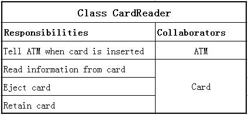

# Review9: Week of Mar 17

## Visual Notation for Programming

1. Let us say that a 'useful diagram' is close to some code base. List two visual notations that are 'useful'. Justify your answer.
2. Define the main parts of a state chart. Give a small example of state chart diagram of a person waiting for an elevator.
3. Define the main parts of compartmental models. Give a small example using the scenario of filling your car with gasoline.
4. Define the main parts of ER diagram. Give a small example using the scenario of placing a book order on Amazon.com.
5. What are the limitations of compartmental models?
6. How is UML similar to ER diagrams?
7. How is UML not similar to ER diagrams?
8. How does compartmental model differ from UML?
9. Why it is bad to get the entity wrong early in the development cycle in ER diagrams?
10. What kind of visual notation is the following diagram? State and explain all of it's parts.
    
    

11. Propose and draw a class diagram equivalent to the above diagram.

## Theory
1. Why we should not build dialogs directly from the data?
2. When and for what purposes should you use 